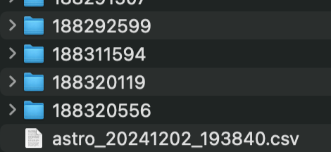

# Adding a new Import Source

- Set `ENABLE_DETAILED_LOGGING=true` in `.env`

- `importSource` logic begins here. This is the value we'll use to swap between importers

```js
// src/import.js
const extractedPivotalData = await pivotalFormatter({
  team,
  directory,
});
```

- This file contains logic specific to this import source, such as a prompt for choosing pivotal statuses. _Start building your new importer here_

- Using the `importSource` value in `import.mjs`, add logic to return a value other than `extractedPivotalData` (e.g., `extractedTrelloData`). A clever mechanism to manage future additions would be nice here.

As long as your code generates a JSON output in this format, all data should migrate into Linear as expected. Key/value pairs may be ommitted if desired.

- It should adhere to this format:

```json
{
  "issues": [
    {
      "isRelease": true,
      "iteration": 1,
      "title": "Issue 1",
      "id": "1",
      "type": "release",
      "dueDate": "",
      "createdAt": "",
      "startsAt": "",
      "endsAt": "",
      "description": "Dropdown menu doesn't close when clicking outside.",
      "state": "unscheduled",
      "priority": "p2 - Medium",
      "labels": "foo, bar",
      "requestedBy": "Samwise Gamgee",
      "ownedBy": ["Frodo Baggins"],
      "estimate": "3",
      "comments": []
    },
    {
      "isRelease": false,
      "iteration": 1,
      "title": "Becomes sub-issue of `Issue 1`",
      "id": "2",
      "type": "feature",
      "dueDate": "",
      "createdAt": "",
      "startsAt": "",
      "endsAt": "",
      "description": "Enhance the login process for better user experience.",
      "state": "in progress",
      "priority": "p1 - High",
      "labels": "ux",
      "requestedBy": "Alice Johnson",
      "ownedBy": ["Mike Johnson", "Tom Wilson"],
      "estimate": "5",
      "comments": ["Initial thoughts", "Need more details", "Final review"]
    },
    {
      "isRelease": false,
      "iteration": 2,
      "title": "Is not a sub-issue",
      "id": "3",
      "type": "feature",
      "dueDate": "",
      "createdAt": "",
      "startsAt": "",
      "endsAt": "",
      "description": "Enhance the login process for better user experience.",
      "state": "in progress",
      "priority": "p1 - High",
      "labels": "login, logout",
      "requestedBy": "Tony Hawk",
      "ownedBy": ["Bob Evans"],
      "estimate": "5",
      "comments": ["Single comment"]
    }
  ],
  "aggregatedData": {
    "userNames": [
      "Samwise Gamgee",
      "Frodo Baggins",
      "Alice Johnson"
      "Mike Johnson",
      "Tom Wilson",
      "Tony Hawk",
      "Bob Evans",
    ],
    "labels": [
      {
        "name": "foo",
        "color": "#6C757D"
      },
      {
        "name": "bar",
        "color": "#6C757D"
      },
      {
        "name": "ux",
        "color": "#6C757D"
      },
      {
        "name": "login",
        "color": "#007BFF"
      }
      {
        "name": "logout",
        "color": "#007BFF"
      }
    ]
  }
}
```

- `isRelease` controls issues that are created as Release Issues (parent issues). In a Pivotal Tracker export, this is true if the value of the `Type` column is `release`.
- There's also a row called `Iteration` in a Pivotal Tracker export. It's an integer, and any issues with the same iteration number will be created as sub-issues under the corresponding release issue.

#### Generic CSV

The current acceptable CSV format, as determined by Pivotal Tracker, is as follows:

```
  Id,
  Title,
  Labels,
  Iteration,
  Iteration Start,
  Iteration End,
  Type,
  Estimate,
  Priority,
  Current State,
  Created at,
  Accepted at,
  Deadline,
  Requested By,
  Description,
  URL,
  Owned By,
  Blocker,
  Blocker Status,
  Comment,
  Comment,
  Task,
  Task Status,
  Review Type,
  Reviewer,
  Review Status,
  Pull Request,
  Git Branch
```

- Order is irrelevant, but all casings must match exactly
- Comments must be formatted across multiple columns:

  ```
  | Comment       | Comment      |
  | ------------- | -----------  |
  | Comment 1     | Comment 2    |
  ```

- `Owned By` may be formatted in a single column or across multiple columns:

  - Single column

    ```
    | Owned By       |
    |----------------|
    | Samwise Gamgee, Frodo Baggins |
    ```

  - Or in multiple columns:

    ```
    | Owned By       | Owned By      |
    | -------------- | ------------- |
    | Samwise Gamgee | Frodo Baggins |
    ```

- You may add any other columns that you would like. This data will not be imported onto the Linear issue itself, but all columns WILL be added to the **Raw Pivotal Tracker Data** comment that's created on each comment.

- You'll have to make some adjustments to logic related to directories depending on your folder structure

  - `src/csv/parse.js`
  - `logger/logger.mjs`
  - `src/files/find_attachments_in_folder.js`

    - File attachments must exist in a folder that matches the `Id` column in the csv

      
      

#### Generic JSON

- Allow reading a JSON file instead of a CSV. Everything else should work as long as the above structure is respected

#### Trello

- TBD

[Open a Pull Request](https://github.com/nverges/pivotal-linear-importer/pulls) and I'd be happy to help
