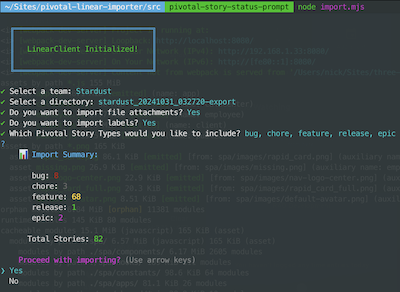

# Pivotal Tracker -> Linear
CLI tool to convert Pivotal Tracker Stories into Linear Issues using the Pivotal Tracker Export CSV feature. Built on top of the official Linear SDK https://github.com/linear/linear/tree/master/packages/sdk, this library includes some extra features that make it easy to convert Pivotal Tracker boards directly into Linear Teams.

## Key Features
- File Attachments
- Comments
- Labels
- Priority
- Due Date
- Created Date
- Import desired story types
- Convert Pivotal Releases into Linear parent issues, with all associated stories in that release cycle as sub-issues
- Generates log files

## Setup
### Installation
1. Create `.env` file and add your Linear API key as `API_KEY`
2. `yarn install`
3. Unzip Pivotal Tracker export and move entire folder into `src/csv/assets`

### Usage
1. `cd src`
2. `node import.mjs`

## Details
### Workflow Statuses
- The following Workflow Statuses will be created in the selected Team. This allows each Team to modify statuses at their own pace without affecting other Teams, and will avoid any naming conflicts with existing statuses.
  - `pivotal - accepted`
  - `pivotal - unscheduled`
  - `pivotal - finished`
  - `pivotal - planned`
  - `pivotal - started`

### Labels
- The following Labels will be created in the selected Team. This allows each Team to modify labels at their own pace without affecting other Teams, and will avoid any naming conflicts with existing labels.
  - `pivotal - epic`
  - `pivotal - release`
  - `pivotal - feature`
  - `pivotal - bug`
  - `pivotal - chore`

- Additionally, you will be prompted with the option to import labels from Pivotal Tracker and have them attached to the created Linear issue.

### Pivotal Release -> Linear Cycle
Linear does not allow for Cycles to be created with dates in the past. Instead, we'll use `Issues` and `Sub-Issues` to mimic this behavior.
  - Every Pivotal Tracker story with type `release` will be created with the label `pivotal - release`
  - Any Pivotal Tracker story that belong to this release iteration will be added as a sub-issue

### ENV Options
- `REQUESTS_PER_SECOND` = 5
  - (varies based on API endpoint)
- `ENABLE_IMPORTING` = true
  - `false` to halt execution before any requests; allows testing CLI
- `ENABLE_DETAILED_LOGGING` = false
  - `true` to show additional output about file attachments

#### API Rate Limits
- Linear sets rate limits on their API usage, which you will probably reach. The Linear team was helpful in increasing my rate limits temporarily. https://developers.linear.app/docs/graphql/working-with-the-graphql-api/rate-limiting.
- The `REQUESTS_PER_SECOND` ENV var can be adjusted to throttle request frequency

#### Logger
- Each import attempt will create a logfile in the `log` directory

## TODO
- Write log file to track successfully imported Pivotal stories to handle failures and prevent duplicate imports
- Pivotal Requester -> Linear Owner
- Pivotal Owner(s) -> Linear Requested By
- Pivotal Estimate -> Linear Estimate
