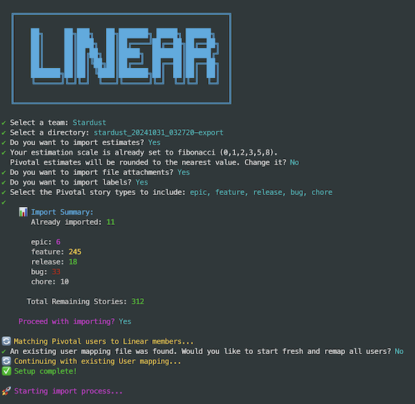
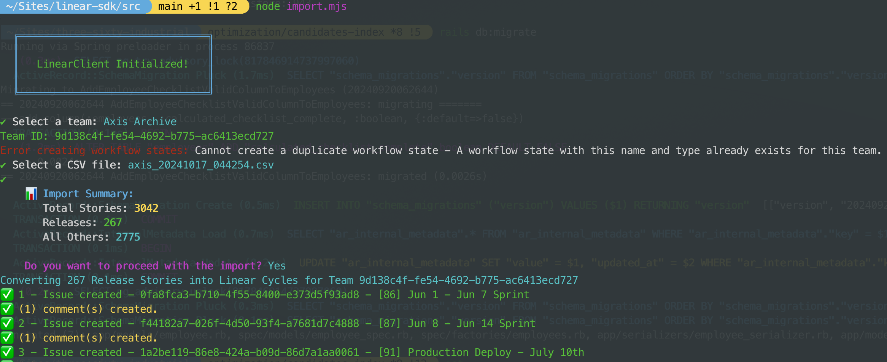
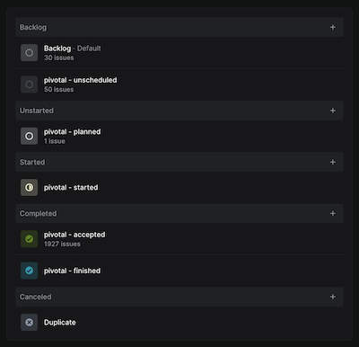

# Pivotal Tracker to Linear Converter

A command-line tool that migrates your Pivotal Tracker projects to Linear. Using Pivotal's CSV export feature, this tool converts:

- Pivotal Stories → Linear Issues
- Pivotal Releases → Linear Parent Issues (with associated stories as sub-issues)
- Preserves attachments, comments, labels, assignees, priorities, and dates

Built with the [Linear SDK](https://github.com/linear/linear/tree/master/packages/sdk).

## Key Features

- [File Attachments](#file-attachments)
- [Comments](#comments)
- [Labels](#labels)
- [Statuses](#statuses)
- [Story Types](#story-types)
- [Releases](#releases) (Pivotal Releases → Linear parent issues with associated stories as sub-issues)
- [Priority](#priority)
- [Assignee](#assignee--smart-user_mapping) (Automatically matches Pivotal Users to Linear Member accounts)
- [Subscribers](#subscribers)
- [Created Date](#created-date)
- [Due Date](#due-date)
- [Safe to retry](#logger) (Skips already imported stories to prevent duplicates)
- [Logger](#logger)

#### Other
- [Notes](#notes)
- [API Rate Limits](#api-rate-limits)
- [TODO](#todo)


## Setup

### Installation

1. Create a Personal API key in Linear under Settings -> API
2. Create a `.env` file and and populate `API_KEY`
3. `yarn install`
4. Unzip Pivotal Tracker export zip file into `assets`
5. Add Team Members in Linear
6. Consider using a burner account before continuing (See [Notes](#notes))

### Usage

1. `cd src`
2. `node import.mjs`



#### ENV Options

- `MAX_REQUESTS_PER_SECOND` = 5
- `ENABLE_IMPORTING` = true
  - `false` to halt execution before any requests; allows testing CLI
- `ENABLE_DETAILED_LOGGING` = false
  - `true` to show additional logging output for user mapping and file attachments

## Details

#### File Attachments

- File attachments can be optionally imported via the provided prompt

#### Comments

- Comments are imported with original author, timestamp, and content preserved.
- A Comment titled `Raw Pivotal Tracker Data` will be created for each issue that contains all CSV data for that issue (except Description and Comments, which are populated directly on the Issue)

#### Labels

- The following Labels will be created in the selected Team. This allows each Team to modify labels at their own pace without affecting other Teams, and will avoid any naming conflicts with existing labels.

  - `pivotal - epic`
  - `pivotal - release`
  - `pivotal - feature`
  - `pivotal - bug`
  - `pivotal - chore`

- Additionally, you will be prompted with the option to import labels created in Pivotal Tracker. These will be added to the imported Linear Issues.

#### Statuses

- The following Workflow Statuses will be created in the selected Team. This allows each Team to modify statuses at their own pace without affecting other Teams, and will avoid any naming conflicts with existing statuses.
  - `pivotal - accepted`
  - `pivotal - unscheduled`
  - `pivotal - finished`
  - `pivotal - planned`
  - `pivotal - started`

#### Story Types

- Configure your import by selecting specific story types via the CLI prompt:



Linear Issues will be assigned a label with the corresponding Story Type (See [Labels](#labels))


#### Releases

- Pivotal Releases → Linear parent issues with:
  - Label: `pivotal - release`
  - Associated stories as sub-issues

#### Assignee / Smart User Mapping

- Automatically matches Pivotal users to Linear team members by comparing names and emails
  - Prompts for manual matching when automatic matching fails
- For stories with multiple owners:
  - First owner becomes the assignee
  - Other owners become subscribers

  
- For stories without owners:
  - Story creator becomes the assignee

- User Map data is stored in `log/<team>/user_mapping.json`:
  ```json
  {
    "generated": "2024-01-01T00:00:00.000Z",
    "mapping": {
      "johndoe42": {
        "linearId": "a1b2c3d4-e5f6-4321-9876-543210fedcba",
        "linearName": "John Doe",
        "linearEmail": "john.doe@acme.com"
      },
      "robotcoder99": {
        "linearId": null,
        "linearName": null,
        "linearEmail": null,
        "note": "No matching Linear user found (manual skip)"
      }
    }
  }
  ```

#### Subscribers

- Pivotal story owners become Linear subscribers
- Pivotal `Requested By` -> Linear `Creator` is not possible because the Linear API prevents this value from being changed
  - `Requested By` becomes either the owner (based on ABC order) or a subscriber
  - `Creator` will be set to the user who created the Personal API Key
  - See **Raw Pivotal Tracker Data** comment for original value

#### Priority

- Priority levels are mapped from Pivotal to Linear as follows:
  - P1 (Pivotal) → High (Linear)
  - P2 → Medium
  - P3 → Low

#### Created Date

- ⏰ Created Date of Pivotal Story will be preserved on the imported Linear Issue
- 📅 Original timestamps are maintained for historical accuracy

#### Due Date

- ✅ Due dates from Pivotal are copied exactly to Linear
- ❌ Stories without due dates in Pivotal will have no due date in Linear

#### Estimates
- [TODO](#todo)

#### Logger

- Unique Team data is stored in team-specific folders (`log/<team-name>`). Each folder contains:
  - `output_<timestamp>.txt`: Complete console output for each import attempt
  - `user_mapping.json` - Maps Pivotal Tracker usernames to Linear user accounts (see [Assignee / Smart User Mapping](#assignee--smart-user_mapping))
  - `successful_imports.csv` - Logs successfully imported Pivotal Stories. These will be skipped on subsequent import attempts, preventing duplicates.

> ⚠️ **WARNING**  
> Deleting `successful_imports.csv` file will cause the importer to lose track of previously imported stories. Only delete this file if you want to start over.

## Other

#### Notes

- Add Team Members in Linear before beginning import to take advantage of Smart User matching. However, users can be manually mapped.
- Since your user account will be the Creator on every imported Issue, you will become a subscriber on every single Issue. You may want to consider using a burner account to perform these imports to avoid unwanted notifications.
- Be mindful of notification preferences for members. This can get noisy while importing 😬

#### API Rate Limits

- Linear sets rate limits on their API usage, which you will probably reach. The Linear team was helpful in increasing my rate limits temporarily. https://developers.linear.app/docs/graphql/working-with-the-graphql-api/rate-limiting.
- The `MAX_REQUESTS_PER_SECOND` ENV var can be adjusted to throttle request frequency

#### TODO
- Pivotal Estimate -> Linear Estimate https://github.com/nverges/pivotal-linear-importer/issues/4
